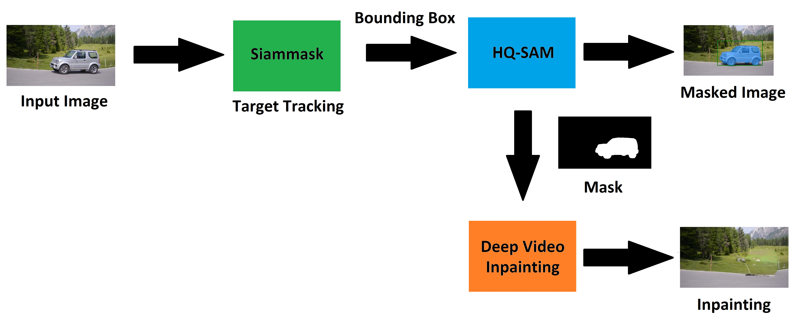

<h1 align="center">Real Time Video Inpainting (PoC)</h1>

This repository is a Proof of Concept (PoC) to create a framework for real-time video inpainting. This framework utilizes three pre-trained machine learning models to achieve the goal. More specifically, a Siammask model is used to track the target and output bound box in real time; an HQ-SAM model for predicting high-quality mask of the selected target from the bounding box; a Deep Video Inpainting model for inpainting the target.

<p align="center">
Framework

</p>

<p align="center">
<table class="center">
  <tr>
    <td style="text-align:center">Input</td>
    <td style="text-align:center">Real-Time Inpainting</td>
  </tr>
  <tr>
    <td></td>
    <td></td>
  </tr>
  <tr>
    <td></td>
    <td></td>
  </tr>
</table>
</p>

<h2 align="center">Setup Environment for Demo</h2>
<p align="left">

The code requires `python>=3.8`, as well as `pytorch>=1.7` and `torchvision>=0.8`. Please follow the instructions [here](https://pytorch.org/get-started/locally/) to install both PyTorch and TorchVision dependencies. Installing both PyTorch and TorchVision with CUDA support is strongly recommended.
</p>

<h3 align="center">Clone the repository locally</h3>
<p align="left">

```
git clone https://github.com/kaikaic1998/Real_Time_Video_Inpainting_PoC.git
cd Real_Time_Video_Inpainting_PoC
```
```
pip install -r requirements.txt
cd Deep_Video_Inpainting/inpainting
bash install.sh
cd ../../
```
</p>

<h3 align="center">Pre-trained Model Checkoints</h3>
<p align="left">
Download the three pre-trained models

Put them in 'Model_CP' folder
</p>

(**Light HQ-SAM** for real-time need): [ViT-Tiny HQ-SAM model.](https://huggingface.co/lkeab/hq-sam/resolve/main/sam_hq_vit_tiny.pth)

(**Siammask**): [Siammask Model.](https://drive.google.com/file/d/1VDoG616hJ3GVywljX4pfdzLEMuCDqml-/view?usp=sharing)

(**Deep Video Inpainting**): [Inpainting Model.](https://drive.google.com/file/d/1Gr72-DYtY2vO6tIA9hw1Mj5-WpInmoFZ/view?usp=sharing)

<h3 align="center">Demo</h3>
<p align="left">

**Default data for demo** `data/car-turn`

```
python run.py
```
</p>

<p align="center">
Start by selecting the target
</p>

<p align="center">

</p>

<h3 align="center">You can try other demo data</h3>

```
python run.py --data/motorbike
```
```
python run.py --data/tennis
```
```
python run.py --data/soccer
```
Try `.mp4` video
```
python run.py --data/soccer.mp4
```

You can also try your own data by putting images in the `data/` folder

Then run demo with your folder name
```
python run.py --data/your_data_folder
```
```
├── data
│   ├── your_data_folder
│   │   ├──  your_images.jpg
```
Try your own `.mp4` video
```
python run.py --data/your_video.mp4
```
```
├── data
│   ├── your_data_folder
│   │   ├──  your_video.mp4
```
</p>

<h2 align="center">Challenges for Real Time Inpainting</h2>
This framework tries to achieve inpainting by tracking and segmenting to create high quality masks for inpainting. The quality of the real-time generation of masks directly impacts the quality of inpainting. 

Here, we discuss that challeges faced for achieving real time inpainting.

<h3 align="center">Real Time Object Segmentation</h3>
<p align="left">
Although there many fast and accurate ML models that are capable of real time object segmentation, however, throughout this project, we found segnmentation error rate increases when at the following situations:

- Target is completely blocked for a certain moments then apears again
- Target size changes constantly
- Target is zoomed in or zoom out rapidly

Additionally, it is difficult to have both accurate and fast segmentation. Higher segmentation accuracy usually takes longer to process, faster segmentation speed usually has lower accuracy.

</p>

<h3 align="center">Real Time Inpainting Model</h3>
<p align="left">
Video inpainting becoming extremely mature recently, however, rarely any can said to achieve real time.

Most of the current video inpainting ML modesl relies on referencing multiple frames before and after the current frame to predict the inpainting area, but taking future frame as input is impossible.

However, recently real time frame generation by AI such as DLSS from Nividia and FSR from AMD prove high quality real time frame generation is feasible. It will be the next objective of this project, study and realize this technic at a personal project level.
</p>

<h3 align="center">CNN and Transformer Models</h3>
<p align="left">
Currently, classic CNN models is still largely used due to its efficiency and relative high accurracy. In comparison, transformer models usually have high accurracy than traditional CNN models, however, speed is still a challenge when input data increases due to the nature of the transformer's design.

There is always trade offs to considered when selecting CNN and transformer models, which remains a challenge for high accuracy real time processing.
</p>

<h2 align="center">Limitations of this Framework</h2>

<p align="left">
As simple shown below, although the quality of the mask within the bounding box is satisfactory, the limitation is the quality of the bounding box. Although most of the tracking ML models can track target accuratly, the bounding box sometimes cannot fully cover the whole target, which affects the quality of the mask prediction. As a result, ghosting effect is produced by the inpainting.
</p>

<p align="center">
<table class="center">
  <tr>
    <td style="text-align:center">Masked Image</td>
    <td style="text-align:center">Real Time Inpainting</td>
  </tr>
  <tr>
    <td></td>
    <td></td>
  </tr>
</p>

<p align="left">
Another example of the limitation of the chosen inpainting model is shown below. This specific inpainting model is trained with the DAVIS dataset, which results in poor inpainting quality with input video that is not from the DAVIS dataset even with perfect mask generated. However, this can be easily improved by fine-tuning the inpainting model with specific datasets to satisfy specific requirements.
</p>

<p align="center">
<table class="center">
  <tr>
    <td style="text-align:center">Masked Image</td>
    <td style="text-align:center">Real Time Inpainting</td>
  </tr>
  <tr>
    <td></td>
    <td></td>
  </tr>
</table>
</p>

<h2 align="center">Citation</h2>
<p align="left">

```
@article{sam_hq,
    title={Segment Anything in High Quality},
    author={Ke, Lei and Ye, Mingqiao and Danelljan, Martin and Liu, Yifan and Tai, Yu-Wing and Tang, Chi-Keung and Yu, Fisher},
    journal = {arXiv:2306.01567},
    year = {2023}
} 
```
```
@article{kirillov2023segany,
  title={Segment Anything},
  author={Kirillov, Alexander and Mintun, Eric and Ravi, Nikhila and Mao, Hanzi and Rolland, Chloe and Gustafson, Laura and Xiao, Tete and Whitehead, Spencer and Berg, Alexander C. and Lo, Wan-Yen and Doll{\'a}r, Piotr and Girshick, Ross},
  journal={arXiv:2304.02643},
  year={2023}
}
```
```
@ARTICLE{kim2020vipami,
  author={Kim, Dahun and Woo, Sanghyun and Lee, Joon-Young and Kweon, In So},
  journal={IEEE Transactions on Pattern Analysis and Machine Intelligence},
  title={Recurrent Temporal Aggregation Framework for Deep Video Inpainting},
  year={2020},
  volume={42},
  number={5},
  pages={1038-1052},}
```
```
@inproceedings{wang2019fast,
    title={Fast online object tracking and segmentation: A unifying approach},
    author={Wang, Qiang and Zhang, Li and Bertinetto, Luca and Hu, Weiming and Torr, Philip HS},
    booktitle={Proceedings of the IEEE conference on computer vision and pattern recognition},
    year={2019}
}
```
</p>